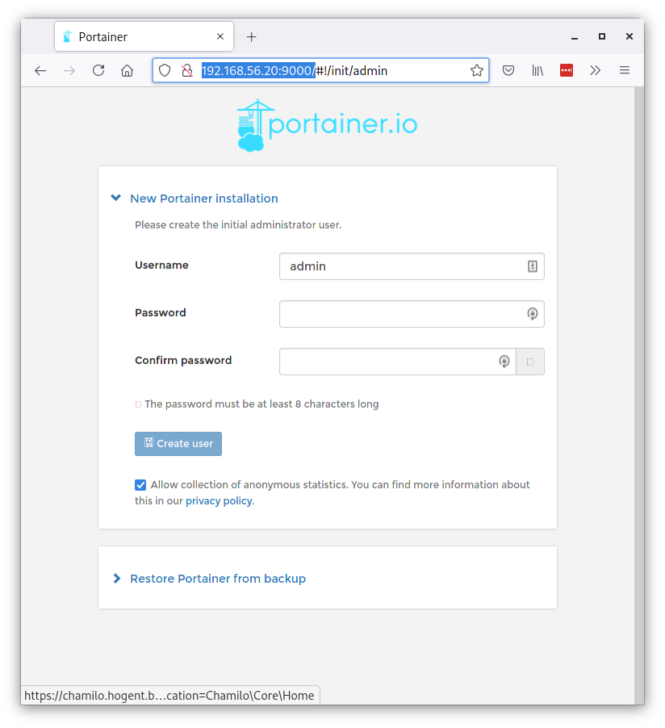
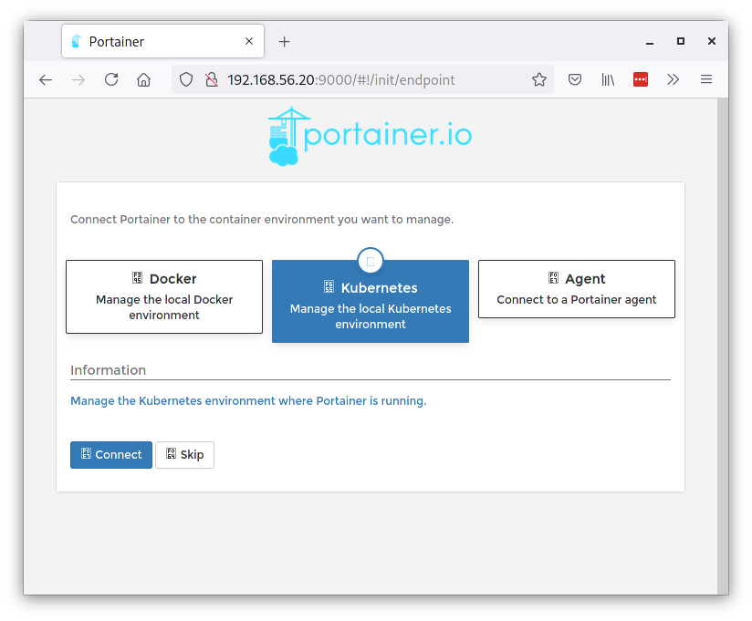
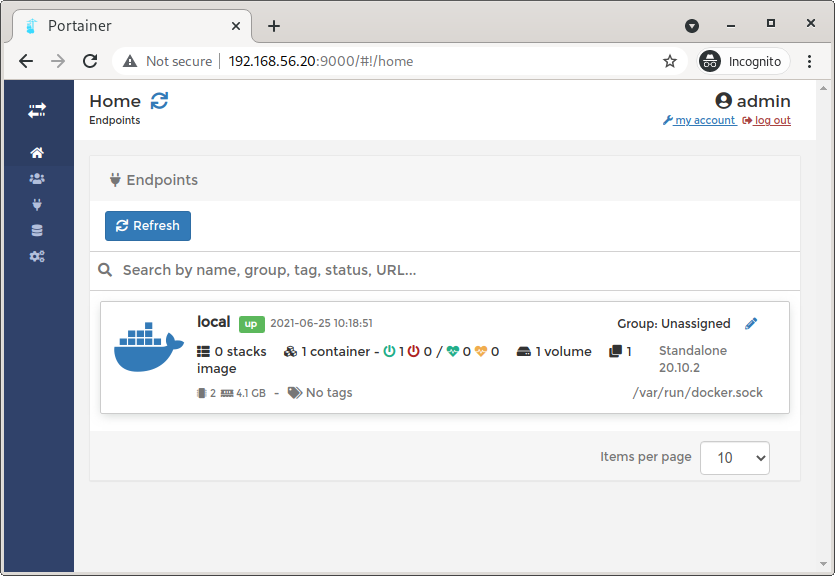
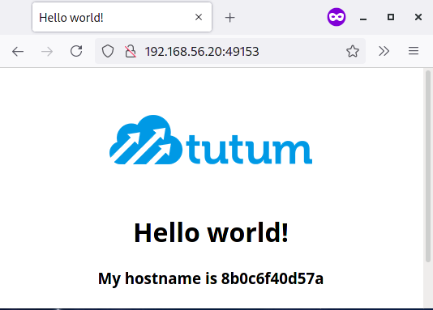
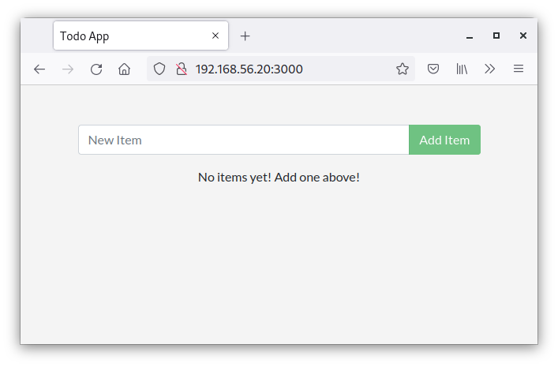

# Lab 1: Container virtualization

In this lab assignment, you'll explore the basic operation of Docker containers. The assignment contains step-by-step instructions that will help you building insight in how Docker works. Remark that you won't be a Docker expert after finishing the assignment. You may not understand everything that's going on the first time you try it. Carefully examine any output to see what happens and how everything works.

The [Get Started](https://docs.docker.com/get-started/) guide at the Docker documentation website is similar to this lab assignment. Going through that guide as well may be useful to gain additional insight.

It is important to keep a detailed lab report, not only so you can show what you've done, but also as a reference for yourself later on. Write a complete transcript of the commands that you execute, the resulting output in the terminal, with screenshots when it's relevant. Don't take screenshots of terminal text! Use Markdown fenced code blocks and copy/paste the text itself.

Add the most common commands that you need to manage Docker in your [cheat sheet](../report/cheat-sheet.md)!

## Learning goals

After completing this assignment, you should have basic understanding on how to work with Docker: managing containers, container images, volumes, and using Docker Compose to set up reproducible, multi-container environments.

## 1.1 Set up the lab environment

Go to the `dockerlab` directory and start the Vagrant environment:

```console
$ cd dockerlab
$ vagrant status
Current machine states:

dockerlab                 not created (virtualbox)

The environment has not yet been created. Run `vagrant up` to
create the environment. If a machine is not created, only the
default provider will be shown. So if a provider is not listed,
then the machine is not created for that environment.
$ vagrant up
Bringing machine 'dockerlab' up with 'virtualbox' provider...

[...]

PLAY RECAP *********************************************************************
dockerlab                  : ok=23   changed=9    unreachable=0    failed=0    skipped=19   rescued=0    ignored=0   
```

The lab environment is set up using Ansible. We're going into that specific subject in the Configuration Management lab assignment.

### Portainer

We already pre-installed and spun up a container with [Portainer](https://www.portainer.io/), a web-ui for managing containers. Strictly speaking, Portainer is not necessary for completing the lab assignment, but it can help novice Docker users to explore the environment: container state, images, networks, etc. Portainer provides similar features as [Docker Desktop](https://docs.docker.com/desktop/). Docker Desktop, however, can only be run on Windows or Mac.

If the `vagrant up` command finished successfully, you can access the web UI by opening a web browser and entering URL <http://192.168.56.20:9000/>. The `dockerlab` VM can be reached from the physical system with IP address 192.168.56.20 (check this by pinging the VM!). Portainer, by default, listens on port 9000.

The fist time you access the Portainer web UI, you will be asked to create an admin user and password:



Choose a password **and be sure to write it down somewhere**, e.g. in your lab report.

In the next step, select the button with "Docker - Manage the local Docker environment" (on the left). You will see a warning that the Portainer container must be run with specific options, but don't worry, that's been taken care of. You can click the "Connect" button at the bottom.



The next page shows available endpoints. There is only one, the local Docker instance. Click on it to enter.



From there you access the Portainer dashboard. Explore the menu on the left and the tiles on the main part of the page to access overviews of containers, images, volumes, etc.

### Managing Docker from the CLI

We explored what's running on the Docker instance through Portainer, but it's important that you can manage Docker from the command line as well. The next part of this lab assignment explores the Docker command line interface. Don't hesitate to use the Portainer UI alongside to see what's happening.

In this VM, based on Ubuntu 20.04 LTS, Docker was already preinstalled and started. If you would want to install Docker on a system manually, check out the [Docker documentation](https://docs.docker.com/engine/install/). Remark that on a standard installation, you need to be root in order to execute Docker commands that change the state of the system. However, in this VM, the default user `vagrant` has been made a member of user group `docker`. As a consequence, it is not necessary to put `sudo` in front of docker commands.

First of all, log in to the dockerlab VM. Open a terminal on your physical system (e.g. Bash on Linux, zsh on MacOS or Git Bash on Windows) and go to the `dockerlab` directory.

```console
$ vagrant ssh dockerlab
Welcome to Ubuntu 20.04.2 LTS (GNU/Linux 5.4.0-73-generic x86_64)

 * Documentation:  https://help.ubuntu.com
 * Management:     https://landscape.canonical.com
 * Support:        https://ubuntu.com/advantage

  System information as of Fri 25 Jun 2021 10:34:39 AM UTC

  System load:                      0.0
  Usage of /:                       4.0% of 61.31GB
  Memory usage:                     7%
  Swap usage:                       0%
  Processes:                        118
  Users logged in:                  0
  IPv4 address for br-6c56e6ec2cf2: 172.30.0.1
  IPv4 address for docker0:         172.17.0.1
  IPv4 address for eth0:            10.0.2.15
  IPv4 address for eth1:            192.168.56.20


This system is built by the Bento project by Chef Software
More information can be found at https://github.com/chef/bento
Last login: Fri Jun 25 08:33:47 2021 from 10.0.2.2
vagrant@dockerlab:~$ 
```

Try out the following commands to check if your Docker instance is running correctly and record the results in your lab report.

- Check the status of the Docker engine: `systemctl status docker`
- Check network TCP server ports that are in use on the system: `sudo ss -tlnp`
- List running Docker containers with `docker ps`
- List Docker images with `docker images`

## 1.2 Our first containers

### Hello world!

Run the command `docker run hello-world` and record the result. This is what will happen:

- The Docker engine notices that it doesn't have an image that matches the name `hello-world` and it will look for one online on the [Docker Hub](https://hub.docker.com). It will find and download the image. Next, it will create a new container based on this image and start it.
- This particular container doesn't do anything useful, but it will print a message ("Hello from Docker!") and exit.

Run `docker ps` and `docker ps -a` and notice the difference in the output.

The `hello-world` container image isn't all that useful, so you can remove it with `docker rmi hello-world`. Docker will complain that a container is still using the image. Remove that container with `docker rm ID` (with ID the container ID listed in the first column of `docker ps`, or the name mentioned in the last column.)

### Interactive and detached containers

Most Linux distributions offer Docker images with a minimal installation that you can use as a platform to run (web) applications. As an example, we'll launch an [Alpine Linux](https://alpinelinux.org/) instance and log into a shell inside the container. Alpine Linux is an extremely small Linux distribution, which is convenient in the context of Docker. The smaller your container, the less resources it uses.

Launch an Alpine container **interactively** (`-i`) and open a shell (`-t`):

```console
docker run -i -t --name alpine alpine
```

You will drop into a root shell inside the container. You can explore the contents. Which commands are available? Compare with the number of commands on the Ubuntu VM.

Open another terminal on your host system and log into the `dockerlab` VM. Execute the following commands and peruse the output. What do these commands do, exactly?

```console
docker container ls
docker inspect alpine
docker top alpine
```

Exit the shell in the Alpine container and repeat the previous commands. Is the container still running?

Next, we will launch the container in the background (*detached*):

```console
docker run -i -t -d --name alpine alpine
```

Docker complains that a container with that name already exists. Remove it with `docker rm alpine`. Repeat the `docker run` command and record the output, a hash identifying the container (the container ID).

Since the container runs in detached mode, and doesn't have any running services, it isn't directly reachable. Try the following commands to execute a command inside the Alpine container and record the results:

```console
docker exec -t alpine /bin/hostname
docker exec -t alpine /sbin/ip a
docker exec -i -t alpine /bin/sh
```

- Compare the host name with the container ID
- What's the IP address of the container? Try to ping it from inside the `dockerlab` VM.
- After you exit the shell, is the container still running? Check with `docker ps` and `docker ps -a`
- Stop and remove the container when you're ready, we won't need it anymore.

### Running a web application

Run the following commands to download a Docker image and launch a container, and record the results. List the available Docker images and running containers afterwards. What's the container ID? What's the IP address of the container?

```console
docker pull tutum/hello-world
docker run -d -p 80 --name helloapp tutum/hello-world
```

The `docker run` command started a container named `helloapp` and exposed port 80. That basically means that the container runs a website and listens on port 80. Check that this is in fact the case using `curl http://IP_ADDRESS/` (with IP_ADDRESS the IP address of the `helloapp` container) and record the result.

Services that run inside containers can be made available to the outside world through port forwarding. Network traffic that arrives on the host system on that port, will be forwarded to port 80 of the container. Consequently, multiple containers may have port 80 exposed, but this will not result in a conflict on the host system, since they will be forwarded through a different port number.

What's the forwarded port for the `helloapp` container? There's several ways to determine this, a.o. `docker ps` and `docker port ID` (with ID the container ID of the `helloapp` container). Check if this works with `curl http://localhost:PORT/` (with PORT the forwarded port) and by opening a browser window on your physical system and go to URL <http://192.168.56.20:PORT>. Record the results, and take a screenshot of the web page. You should get something like this:

.

## 1.3 Persistent data

When you stop and remove a container, all data in that container is gone. Often, it is necessary to preserve some data between consecutive instances of a container. In this section, we'll create a container with a MySQL database and we'll see how you can save the database contents even after the container was destroyed.

First, fetch the official MySQL Docker image from the registry. Then, create a Docker volume that will be used to store persistent data within the container:

```console
docker volume create mysql-data
docker volume inspect mysql-data
```

The second command can be used to check where the volume contents are actually stored. What is the mount point of the volume?

### Adding a volume to a container

Start the MySQL container with the following command:

```console
docker run --name db -d \
  -v mysql-data:/var/lib/mysql \
  -p 3306:3306 \
  -e MYSQL_DATABASE='appdb' \
  -e MYSQL_USER='appusr' \
  -e MYSQL_PASSWORD='letmein' \
  -e MYSQL_ROOT_PASSWORD='letmein' \
  mysql:5.7
```

Note: the backslashes `\` at the end of each line indicate that the Bash command has not yet finished and continues to the next line. If you type the command you can do this on one long line, without the `\` characters.

The meaning of the options:

- `--name`: name for this container (`db`)
- `-d`: start the container in "detached" mode (in the background)
- `-v`: mount the contents of the Docker volume `mysql-data` inside the container at the path `/var/lib/mysql`. After removing the container, data in this volume will be preserved!
- `-p`: make sure that server port 3306 in the container is also reachable via port 3306 on the host system.
- `-e`: Initializes an environment variable with the specified value. You can find the meaning of these specific variables in the [MySQL Docker image documentation](https://hub.docker.com/_/mysql). The MySQL root password is set, and a database is created with a user who has full privileges to it.
- `mysql:5.7` on the last line is the name of the image this container is based on.

Check that you can view the logs of the MySQL container with `docker logs -f db`. You can open a separate terminal window to watch the logs throughout the next part of this lab assignment.

Now open a MySQL text console inside the container:

```console
$ docker exec -it db mysql -pletmein appdb

mysql: [Warning] Using a password on the command line interface can be insecure.
Welcome to the MySQL monitor.  Commands end with ; or \g.
Your MySQL connection id is 8
Server version: 8.0.26 MySQL Community Server - GPL

Copyright (c) 2000, 2021, Oracle and/or its affiliates.

Oracle is a registered trademark of Oracle Corporation and/or its
affiliates. Other names may be trademarks of their respective
owners.

Type 'help;' or '\h' for help. Type '\c' to clear the current input statement.

mysql> 
```

Create a table in the `appdb` database and add some records:

```console
mysql> CREATE TABLE Catalog(CatalogId INTEGER PRIMARY KEY,Journal VARCHAR(25),Publisher VARCHAR(25),Edition VARCHAR(25),Title VARCHAR(45),Author VARCHAR(25));
Query OK, 0 rows affected (0.06 sec)

mysql> INSERT INTO Catalog VALUES('1','Oracle Magazine','Oracle Publishing','November December 2013','Engineering as a Service','David A. Kelly');
Query OK, 1 row affected (0.03 sec)
```

Check if the table has been created correctly. Pay attention! Table names are case sensitive.

```console
mysql> show tables;
mysql> SELECT * FROM Catalog;
```

If you have installed MySQL Workbench on your physical system, you can use it to access the database in the container! Connect to host 192.168.56.20, with the credentials specified with the `-e` options when you started the container.

The mysql command line client should also work, either from within the VM, or even from the physical system:

```console
mysql -h 192.168.56.20 -P 3306 -uroot -pletmein appdb
```

Or you can execute an SQL query on the database:

```console
$ mysql -h 192.168.56.20 -P 3306 -uappusr -pletmein appdb <<< "SELECT * FROM Catalog;"mysql: [Warning] Using a password on the command line interface can be insecure.
CatalogId       Journal Publisher       Edition Title   Author
1       Oracle Magazine Oracle Publishing       November December 2013  Engineering as a Service        David A. Kelly
```

### Persistence of volumes between container instances

We now have succesfully set up a database that is available to any application or user that needs it.

Take a look at the directory for the volume we created earlier. You should find a directory for the `appdb` database and a file that contains the `Catalog` table.

Now, stop the database container and try to restart it:

```console
$ docker stop db
db
$ docker start db
db
```

Verify that the database is still working and that all data was preserved.

Stop the container and try to start it with the `docker run` command that you used to create it. You'll get a name conflict. Now actually remove the container and retry the `docker run` command. Verify that the database still exists.

We now have successfully created a volume that can be used to store persistent data that can survive when the container is destroyed.

**Note:** Running a database in a container can be useful for test setups, but in production you need a more robust solution, a dedicated server (either "bare metal" or a high-performance VM) used just for that purpose.

## 1.4 Custom images

In many situations, e.g. when you want to deploy a webapplication in a container, you'll need to customize an existing Docker image, or create one from scratch. In this part of the lab, we'll explore the possibilities.

First, go to the directory `/vagrant/labs/static-website` and look at the contents

```console
$ cd /vagrant/labs/static-website
$ tree
.
├── Dockerfile
└── files
    ├── default.conf
    ├── index.html
    ├── nginx.conf
    ├── site-contents.tar.bz2
    └── works-on-my-machine-ops-problem-now.jpg

1 directory, 6 files
```

This directory contains the necessary files to set up a container that hosts a static website. The files with extension .conf contain settings for the Nginx webserver. The .tar.bz2 file contains the website contents (in this case, the file index.html and the jpg-file in the files/ directory).

### Dockerfiles

Look at the contents of the file `Dockerfile`, which contains the instructions for creating an image.

```Dockerfile
FROM alpine:latest
LABEL description="This example Dockerfile installs NGINX."
RUN apk add --update nginx && \
    rm -rf /var/cache/apk/* && \
    mkdir -p /tmp/nginx/
COPY files/nginx.conf /etc/nginx/nginx.conf
COPY files/default.conf /etc/nginx/conf.d/default.conf
ADD files/site-contents.tar.bz2 /usr/share/nginx/
EXPOSE 80/tcp
ENTRYPOINT ["nginx"]
CMD ["-g", "daemon off;"]
```

- The `FROM` directive indicates that we start with an Alpine Linux image.
- The `LABEL` contains a description
- The `RUN` directive contains commands that will install the necessary packages (the Nginx web server, in this case) and perform other configuration tasks. A `RUN` directive can only contain a single line of code, so several commands must be combined with the Bash `&&` operator and every line (except the last one) ends with `\` (line continuation character).
- On the next two lines starting with `COPY`, the necessary configuration files are copied into the container
- The `ADD` directive will copy the tar archive containing the website contents to the container and will automatically extract the contents into the target directory `/usr/share/nginx`
- `EXPOSE` indicates that server port 80 of the container will be used and should be exposed to the host system
- Finally, `ENTRYPOINT` and `COMMAND` indicate how the container should be started, in this case by running the Nginx service.

More information about the syntax of a Dockerfile can be found in the [reference documentation](https://docs.docker.com/engine/reference/builder/).

Remark that in a container, we don't use the `systemctl start` command to start a service. Since a container should only run a single application, an init system like systemd is overkill.

### Building a custom container image

Build the container image (don't forget the dot in the end, denoting the current directory!), and show a list of all images to check if it succeeded:

```console
docker image build --tag local:static-site .
docker image ls
```

Now, start a container based on this image, forward port 8080 on the host system to port 80 of the container:

```console
docker run -d -p 8080:80 --name nginx local:static-site
```

Now check if the website is available. Inside the VM, you should be able to fetch the index page with `curl http://localhost:8080/`. On your physical system, open a webbrowser and point it to `http://192.168.56.20:8080/` and verify that the web page is visible. It should contain a simple message ("Hello world/It works!").

### Discussion

The `Dockerfile` format is rather awkward and very limited. For example, the RUN directive can only contain a single line with a shell command. Each RUN will result in an extra filesystem "layer" (see below), so it's best to minimise the number of RUNs in a Dockerfile. Consequently, you are forced to combine multiple commands with `&&` and to split long lines with `\`. This results in an inelegant coding style. Furthermore, more complex shell scripting concepts like functions can not be used.

If your needs are becoming too complex, it's best to keep the Dockerfile as simple as possible, and use a configuration management system for the rest of the installation.

## 1.5 Layered file system

A Docker image is fundamentally different than a "normal" VM disk image. The latter is nothing more than a file containing, byte for byte, the contents of what would be written to a physical disk partition. When mounted, it contains the filesystem with a directory tree. A Docker image consists of several so-called layers. Each layer adds some files and/or directories to the filesystem.

### Inspecting layers of an image

Take a look at the Dockerfile from the previous part of the lab. It's based on the `alpine:latest` image. Run the command `docker image inspect alpine:latest`. You will see detailed information about the image, in JSON format. Look for the information about the filesystem layers. You should find that the image consists of a single layer, identified by a SHA-256 checksum. Write down the checksum in your lab report.

Tip: You can format JSON data with the command line tool jq. Pipe the output of the `docker inspect` command to `jq` without options or arguments for "pretty printed" output (coloured and indented). You can filter out only the relevant part of the output (about the layers) with:

```console
docker image inspect alpine:latest | jq ".[]|.RootFS.Layers"
```

Now inspect the layers of the `local:static-site` image. How many layers does this image have? Compare the SHA-256 checksum of the layers with the one from the `alpine:latest` image. You should see that the first layer is nothing more or less than the Alpine image! This image is reused to build our custom image. You can find the actual images of these layers in directory `/var/lib/docker/image/overlay2/layerdb/sha256`. Each layer has its own file, with the SHA-256 hash as name.

### Dockerfile directives and layers

Edit the `Dockerfile` for the `static-site` image and split up the `RUN` directive into three separate lines:

```Dockerfile
RUN apk add --update nginx
RUN rm -rf /var/cache/apk/*
RUN mkdir -p /tmp/nginx/
```

Rebuild the image (give it another name, e.g. `static-site-2`). How many layers do you see now? How many more layers do you have, compared to the previous version? Which layers are still the same and which ones are not? Which directives in the Dockerfile do you think are responsible for adding extra layers?

### Impact of Dockerfile changes on layers

Make any change to the `index.html` file (e.g. change the background colour), recreate the .tar.bz2 archive and rebuild the image. Check the output of the build process. You should see that some layers can be reused from the previous image version (message "Using cache" in the output). Inspect the layers and check which ones have changed and which ones haven't.

## 1.6 Docker compose

A container should only have a single application running inside. Consequently, putting an entire LAMP-stack (webserver + database) in a single container is bad practice. When we want to run a dynamic webapplication with a database backend on Docker, we need at least two containers: one with the database, the other with the webserver. The webserver can only start if the database is already up and running. Environments with multiple containers and dependencies between services running on them are quite common.

Docker Compose is a tool that was developed to help define and share multi-container applications. With Compose, we can create a YAML file to define the services and with a single command, can spin everything up or tear it all down.

In this part of the assignment, you will use a compose file to set up a reproducible multi-container application stack.

In the dockerlab VM, go to `/vagrant/labs/todo-app`. This directory contains a Node.js demo application, a todo-list, that is also used in the [Docker Get Started guide](https://docs.docker.com/get-started/). The directory also contains a Dockerfile. Use it to build an image for the application container, named `todo-app` and start it (by now, you should know how!). The application uses port 3000. Use port forwarding so you can access the application from the physical system. Check that the application is running by opening a browser window and entering the application's URL:



Also check the container and image in Portainer!

The application is built so it can run without a database backend. Check the container's log to see how it saves data! However, when you point it to a MySQL database server, it will use that. Our goal is to set up an application stack with two containers, one for the app and the other for the database. The data stored in the database should of course be persistent.

Open the `docker-compose.yml` file in the directory `dockerlab/labs/todo-app` and carefully examine the contents and comments. This file defines two containers, `app` and `db`. It also contains the instructions to build the image, that you can also find in the `Dockerfile`. Finally, a volume is defined that will be used to make the database contents persistent.

Stop the currently running instance of the application container and then run the command:

```console
docker-compose up -d
```

The `-d` option will run docker-compose in the background so you can immediately use the terminal.

Use portainer or the command line to inspect the containers. What are the names and IP addresses of the two containers?

Remark that we don't need to know the IP address in order to communicate between containers in the same stack. The container names, as specified in the docker-compose file are configured as hostname aliases and will resolve to an IP-address inside the container. Verify this by opening a console (`/bin/sh`) inside the app container and try the following commands:

```console
ping db
getent ahosts db
```

Note that the `getent ahosts` command can be used to test DNS name resolution on systems where the `dig` or `nslookup` commands are not available.

## Acceptance criteria

- Show volumes, images, and containers present on the `dockerlab` VM, both in Portainer and on the command line.
- Show that you are able to launch a detached container, query its IP address and open a shell.
- Show that the different containers launched for this assignment (a.o. `helloapp`, `db`, `static-site`, the environment set up with Docker Compose, etc.) are running by opening the hosted website in a web browser, or by querying the database.
- Show your lab report and cheat sheet! Your report should contain screenshots of intermediate milestones and console output (using Markdown fenced code blocks!) of commands you used. Your cheat sheet should contain an overview of the most important commands that you used to finish this assignment.
